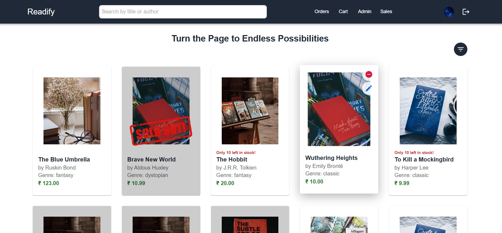

# 📚 Book Store App

Welcome to the **Book Store App**! This full-stack web application lets you
browse, purchase, and manage books online. With a modern interface and robust
backend, it ensures a seamless experience for both customers and administrators.



---

## 🚀 Features

### 👤 **User Features:**

- 🔒 **Authentication:** Secure login and registration using Auth0.
- 📖 **Book Browsing:** Explore books by genre, title, or author.
- 🔍 **Search & Filter:** Advanced search and filter capabilities.
- 🛒 **Cart Management:** Add, update, and remove books from the cart.
- 📦 **Order Management:** Place orders and view order history.
- 🧑‍💼 **Profile Management:** Manage personal information, including profile
  pictures.

### 🔧 **Admin Features:**

- 🛡️ **Role-Based Access:** Manage book listings.
- ✅ **Book Approval:** Approve or reject books submitted by salesmen.

---

## 🧑‍💻 Tech Stack

| **Frontend**          | **Backend**          | **Other Tools**    |
| --------------------- | -------------------- | ------------------ |
| ⚛️ React (TypeScript) | 🟢 Node.js (Express) | 🐳 Docker          |
| 💅 Material-UI (MUI)  | 🗄️ PostgreSQL        | 🧹 ESLint |
| 🚦 React Router       | 🔗 RESTful APIs      | 🔑 UUID for IDs    |
| 📦 Context API        | 🌐 Fetch API         |                    |

---

## ⚙️ Installation

### Frontend Setup

1. **Clone the Frontend Repository:**

   ```bash
   git clone https://github.com/Apoorv-Patel1207/book_store_frontend_rev_1.git
   cd book_store_frontend_rev_1
   ```

2. **Install Dependencies:**

   ```bash
   npm install
   ```

3. **Set Up Environment Variables:**

   - Create a `.env` file in the root directory.
   - Add variables for Auth0, PostgreSQL, and other API configurations.

4. **Run the Application:**

   ```bash
   npm run start:dev
   ```

5. **Access the App:**

   - Visit `http://localhost:3000` in your browser.

### Backend Setup

1. **Clone the Backend Repository:**

   ```bash
   git clone https://github.com/Apoorv-Patel1207/book_store_backend_rev_1.git
   cd book_store_backend_rev_1
   ```

2. **Install Backend Dependencies:**

   ```bash
   npm install
   ```

3. **Set Up Environment Variables:**

   - Create a `.env` file in the backend root directory.
   - Configure database credentials and API secrets.

4. **Run the Backend Server:**

   ```bash
   npm start
   ```

---

## 🗃️ Database Schema

### Example Database Tables

| **Table Name** | **Description**       |
| -------------- | --------------------- |
| 👥 Users       | Stores user details   |
| 📚 Books       | Contains book data    |
| 🛒 Orders      | Manages placed orders |
| 🛍️ Cart        | Tracks cart contents  |

---

## 🚢 Deployment

- 🐳 Use Docker for containerized deployment.
- 🗄️ Configure PostgreSQL and the backend API service.

---

## 🌟 Future Enhancements

- 💳 **Payment Integration:** Add payment gateway support.
- 🔔 **Notifications:** Implement order and shipping notifications.
- 🎨 **Enhanced UI:** Further improve responsiveness and accessibility.

---

## 👥 Contributors

- **Apoorv Patel** - Developer

---

💫 Special Thanks

- **Rishi Anand** - Mentor & Guide

---

**🎉 Thank you for exploring the Book Store App!**
